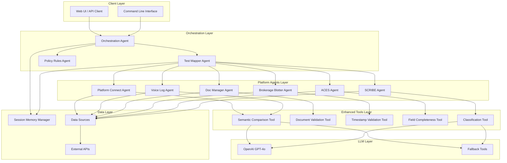

# Enhanced LangChain QA Pipeline Architecture

## System Overview

## Component Details

### Orchestration Layer
- **Orchestration Agent**: Main coordinator, categorizes tickets, manages workflow
- **Test Mapper Agent**: Maps test objectives to required agents and tools
- **Policy Rules Agent**: Manages test matrix, execution rules, quality gates

### Platform Agents Layer
- **Platform Connect Agent**: Handles Connect platform data, eligibility validation, timely execution
- **Voice Log Agent**: Manages voice log analysis, client confirmation, advice detection
- **Doc Manager Agent**: Validates document presence, engagement status, bilateral agreements
- **Brokerage Blotter Agent**: Handles authorization, syndicate allocation, trade documentation
- **ACES Agent**: Validates ACES field completeness
- **SCRIBE Agent**: Manages SCRIBE process validation

### Enhanced Tools Layer
- **Semantic Comparison Tool**: LLM-based text comparison with rule-based fallback
- **Document Validation Tool**: Document presence and metadata validation
- **Timestamp Validation Tool**: SLA checking with robust timestamp parsing
- **Field Completeness Tool**: Structured data completeness validation
- **Classification Tool**: LLM-based classification with rule-based fallback

### Data Layer
- **Session Memory Manager**: Centralized state management for extracted data and test results
- **Data Sources**: Connect, Voice Logs, Doc Manager, Brokerage Blotter, ACES, SCRIBE
- **External APIs**: Platform-specific APIs for data extraction

### LLM Layer
- **OpenAI GPT-4o**: Advanced language model for classification and semantic analysis
- **Fallback Tools**: Rule-based alternatives when LLM is unavailable

## Data Flow

1. **Input**: Ticket data received via UI or CLI
2. **Categorization**: Orchestration Agent categorizes ticket type
3. **Data Extraction**: Platform Agents extract data from respective sources
4. **Test Mapping**: Test Mapper Agent determines required tests
5. **Test Execution**: Platform Agents execute tests using Enhanced Tools
6. **LLM Processing**: Advanced tests use LLM with fallback to rules
7. **Result Aggregation**: Results collected and summarized
8. **Output**: Final QA report with pass/fail status

## Key Features

- **Modular Architecture**: Each component is independently testable and maintainable
- **Scalable Design**: Easy to add new platform agents and test types
- **Robust Error Handling**: Graceful fallbacks when APIs or LLM fail
- **Parallel Execution**: Multiple tests can run simultaneously
- **Audit Trail**: Complete traceability of all operations
- **Production Ready**: Handles real-world scenarios and edge cases
