# Enhanced LangChain QA Platform Architecture

## System Overview

This diagram represents the overall architecture of the Enhanced LangChain QA Platform, showing the complete system design, data flows, and component interactions.

```mermaid
graph TB
    %% External Systems
    subgraph "External Data Sources"
        CONNECT[Connect Platform<br/>Order Management]
        BLOTTER[Brokerage Blotter 2.0<br/>Trade Execution]
        DOCMGR[Doc Manager<br/>Document Storage]
        VOICE[Voice Logs<br/>Call Recording]
        ACES[ACES System<br/>Compliance Forms]
        SCRIBE[SCRIBE<br/>Process Management]
    end

    %% Core LangChain Pipeline
    subgraph "Enhanced LangChain QA Pipeline"
        subgraph "Orchestration Layer"
            ORCH[Orchestration Agent<br/>Ticket Categorization<br/>Workflow Coordination]
            SESSION[Session Manager<br/>State Management<br/>Data Persistence]
        end

        subgraph "Data Layer"
            DATA[Data Agent<br/>Multi-Source Extraction<br/>Schema Validation]
            SCHEMA[Schema Engine<br/>Data Mapping<br/>API Configuration]
        end

        subgraph "Test Management Layer"
            TESTMGR[Test Management Agent<br/>DAG Generation<br/>Dependency Resolution]
            TESTMAP[Test Mapper Agent<br/>Test-to-Platform Mapping]
            POLICY[Policy Rules Agent<br/>Business Logic<br/>Conditional Execution]
        end

        subgraph "Execution Layer"
            TESTEXEC[Enhanced Test Execution Agent<br/>Test Orchestration<br/>Parallel Processing]
            PLATFORM[Platform Agents<br/>Specialized Validation]
        end

        subgraph "Platform Agents"
            PCONNECT[Platform Connect Agent<br/>Eligibility & Timing]
            VLOG[Voice Log Agent<br/>Call Analysis & Confirmation]
            DMGR[Doc Manager Agent<br/>Document Validation]
            BBLOTTER[Brokerage Blotter Agent<br/>Authorization & Allocation]
            ACESAGENT[ACES Agent<br/>Field Completeness]
            SCRIBEAGENT[SCRIBE Agent<br/>Process Validation]
        end

        subgraph "Enhanced Tools"
            SEMANTIC[Semantic Comparison Tool<br/>LLM-based Text Analysis]
            DOCVAL[Document Validation Tool<br/>Presence & Metadata Check]
            TIMESTAMP[Timestamp Validation Tool<br/>SLA Compliance]
            COMPLETENESS[Field Completeness Tool<br/>Data Quality Check]
            CLASSIFICATION[Classification Tool<br/>Rule-based + LLM Fallback]
        end

        subgraph "Decision Layer"
            AGGREGATOR[Result Aggregator<br/>Test Results Compilation]
            DECISION[Decision Agent<br/>Pass/Fail Determination]
            EXCEPTION[Exception Agent<br/>Error Handling & Notifications]
        end
    end

    %% Web Interface
    subgraph "Web Interface"
        WEB[Web Demo Interface<br/>Real-time Visualization<br/>Leadership Presentation]
        API[REST API<br/>Workflow Control<br/>Status Monitoring]
    end

    %% Data Flow Connections
    CONNECT --> DATA
    BLOTTER --> DATA
    DOCMGR --> DATA
    VOICE --> DATA
    ACES --> DATA
    SCRIBE --> DATA

    DATA --> SESSION
    SCHEMA --> DATA

    ORCH --> SESSION
    ORCH --> TESTMGR
    ORCH --> DATA

    TESTMGR --> TESTMAP
    TESTMGR --> POLICY
    TESTMGR --> TESTEXEC

    TESTEXEC --> PLATFORM
    TESTEXEC --> SEMANTIC
    TESTEXEC --> DOCVAL
    TESTEXEC --> TIMESTAMP
    TESTEXEC --> COMPLETENESS
    TESTEXEC --> CLASSIFICATION

    PLATFORM --> PCONNECT
    PLATFORM --> VLOG
    PLATFORM --> DMGR
    PLATFORM --> BBLOTTER
    PLATFORM --> ACESAGENT
    PLATFORM --> SCRIBEAGENT

    TESTEXEC --> AGGREGATOR
    AGGREGATOR --> DECISION
    DECISION --> EXCEPTION

    SESSION --> WEB
    AGGREGATOR --> WEB
    DECISION --> WEB

    WEB --> API
    API --> ORCH

    %% Styling
    classDef external fill:#e1f5fe,stroke:#01579b,stroke-width:2px
    classDef orchestration fill:#f3e5f5,stroke:#4a148c,stroke-width:2px
    classDef data fill:#e8f5e8,stroke:#1b5e20,stroke-width:2px
    classDef test fill:#fff3e0,stroke:#e65100,stroke-width:2px
    classDef platform fill:#fce4ec,stroke:#880e4f,stroke-width:2px
    classDef tools fill:#f1f8e9,stroke:#33691e,stroke-width:2px
    classDef decision fill:#fff8e1,stroke:#f57f17,stroke-width:2px
    classDef web fill:#e3f2fd,stroke:#0d47a1,stroke-width:2px

    class CONNECT,BLOTTER,DOCMGR,VOICE,ACES,SCRIBE external
    class ORCH,SESSION orchestration
    class DATA,SCHEMA data
    class TESTMGR,TESTMAP,POLICY,TESTEXEC test
    class PCONNECT,VLOG,DMGR,BBLOTTER,ACESAGENT,SCRIBEAGENT platform
    class SEMANTIC,DOCVAL,TIMESTAMP,COMPLETENESS,CLASSIFICATION tools
    class AGGREGATOR,DECISION,EXCEPTION decision
    class WEB,API web
```

## Component Descriptions

### External Data Sources
- **Connect Platform**: Order management, trade inquiry, profile canvas, fee transparency
- **Brokerage Blotter 2.0**: Trade execution, syndicate allocation, authorization
- **Doc Manager**: Document storage, bilateral agreements, SCRF/DRE documentation
- **Voice Logs**: Call recordings, client confirmations, communication analysis
- **ACES System**: Compliance forms, field validation, regulatory reporting
- **SCRIBE**: Process management, workflow tracking, remediation

### Core Pipeline Components
- **Orchestration Agent**: Central coordinator, ticket categorization, workflow management
- **Data Agent**: Multi-source data extraction with schema validation
- **Test Management Agent**: DAG generation, test sequencing, dependency resolution
- **Enhanced Test Execution Agent**: Parallel test execution with retry logic
- **Platform Agents**: Specialized validation for each data source
- **Enhanced Tools**: Advanced validation capabilities using LLM and rule-based logic

### Key Features
- **Parallel Processing**: Up to 8 tests execute simultaneously
- **Conditional Logic**: Tests skip based on business conditions
- **Fallback Mechanisms**: Rule-based fallbacks when LLM unavailable
- **Real-time Monitoring**: Live status updates and progress tracking
- **Comprehensive Logging**: Detailed audit trail and error reporting

## Data Flow
1. **Input**: Trade ticket metadata and content
2. **Categorization**: Determine ticket type and required tests
3. **Data Extraction**: Pull data from all relevant sources
4. **Test Planning**: Generate execution DAG based on dependencies
5. **Test Execution**: Run tests in parallel with specialized agents
6. **Result Aggregation**: Compile results and calculate metrics
7. **Decision Making**: Determine pass/fail based on success criteria
8. **Output**: Detailed results, exception handling, notifications
