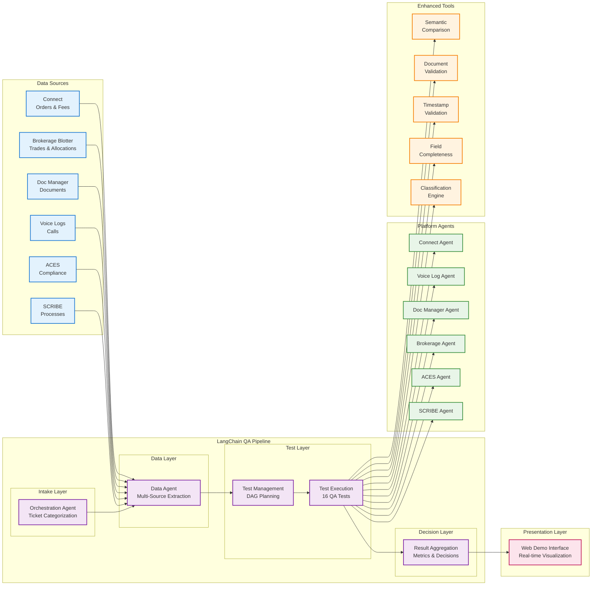

# Enhanced LangChain QA Platform - System Overview

## High-Level Architecture

This diagram provides a simplified, high-level view of the Enhanced LangChain QA Platform architecture, focusing on the main components and data flow.

## Component Responsibilities

### Data Sources (6 Platforms)
- **Connect**: Order management, fee transparency, profile canvas
- **Brokerage Blotter**: Trade execution, syndicate allocation, authorization
- **Doc Manager**: Document storage, bilateral agreements, SCRF/DRE
- **Voice Logs**: Call recordings, client confirmations, communication
- **ACES**: Compliance forms, field validation, regulatory reporting
- **SCRIBE**: Process management, workflow tracking, remediation

### Core Pipeline
- **Orchestration Agent**: Central coordinator, ticket categorization
- **Data Agent**: Multi-source data extraction with validation
- **Test Management**: DAG generation, test sequencing, dependencies
- **Test Execution**: Parallel execution of 16 comprehensive QA tests
- **Result Aggregation**: Metrics calculation, decision making

### Platform Agents (6 Specialized)
- **Connect Agent**: Eligibility validation, timely execution
- **Voice Log Agent**: Call analysis, client confirmation
- **Doc Manager Agent**: Document presence, engagement status
- **Brokerage Agent**: Authorization, syndicate allocation
- **ACES Agent**: Field completeness, compliance validation
- **SCRIBE Agent**: Process validation, workflow tracking

### Enhanced Tools (5 Advanced)
- **Semantic Comparison**: LLM-based text analysis
- **Document Validation**: Presence and metadata checking
- **Timestamp Validation**: SLA compliance verification
- **Field Completeness**: Data quality assessment
- **Classification Engine**: Rule-based + LLM fallback

## Key Capabilities

### Scalability
- **Parallel Processing**: Up to 8 tests execute simultaneously
- **Modular Design**: Easy to add new tests and data sources
- **Cloud Ready**: Designed for horizontal scaling

### Reliability
- **Fallback Mechanisms**: Rule-based logic when LLM unavailable
- **Error Handling**: Comprehensive retry logic and exception management
- **Audit Trail**: Complete logging for compliance and debugging

### Flexibility
- **Conditional Logic**: Tests skip based on business conditions
- **Configurable Rules**: Easy to modify test criteria and thresholds
- **Multi-tenant**: Supports different ticket types and workflows

### Performance
- **Fast Execution**: ~2 seconds for complete test suite
- **Real-time Updates**: Live status monitoring and progress tracking
- **Efficient Resource Usage**: Optimized data extraction and processing
