# QA Test DAG (Directed Acyclic Graph) - 16 Test Flow

## Test Execution Flow

```mermaid
graph TD
    Start([Start: Ticket Processing]) --> T1[Test 1: Eligibility Validation]
    Start --> T2[Test 2: Voice Log Validation]
    Start --> T3[Test 3: Order Placer Authorization]
    Start --> T4[Test 4: Client Confirmation - No Engage]
    Start --> T5[Test 5: Client Confirmation - Engage]
    Start --> T6[Test 6: Unapproved Products Advice]
    Start --> T7[Test 7: SCRF/DRE Documentation]
    Start --> T8[Test 8: Trade Solicitation Documentation]
    Start --> T9[Test 9: Trade Documentation Verification]
    Start --> T10[Test 10: MFO Advice Validation]
    Start --> T11[Test 11: Timely Execution Check]
    Start --> T12[Test 12: Engagement Status Verification]
    Start --> T13[Test 13: Bilateral Agreement Documentation]
    Start --> T14[Test 14: Syndicate Allocation Validation]
    Start --> T15[Test 15: New Subscription Status]
    
    T1 --> T16[Test 16: ACES Fields Completeness]
    T2 --> T16
    T3 --> T16
    T4 --> T16
    T5 --> T16
    T6 --> T16
    T7 --> T16
    T8 --> T16
    T9 --> T16
    T10 --> T16
    T11 --> T16
    T12 --> T16
    T13 --> T16
    T14 --> T16
    T15 --> T16
    
    T16 --> End([End: Final QA Report])
    
    %% Conditional Logic
    T4 -.->|Engage = No| T4_Exec[Execute Test 4]
    T4 -.->|Engage = Yes| T4_Skip[Skip Test 4]
    
    T5 -.->|Engage = Yes| T5_Exec[Execute Test 5]
    T5 -.->|Engage = No| T5_Skip[Skip Test 5]
    
    T6 -.->|Order Type ≠ Approved| T6_Exec[Execute Test 6]
    T6 -.->|Order Type = Approved| T6_Skip[Skip Test 6]
    
    T7 -.->|Order Type = FVEQ New Issuance| T7_Exec[Execute Test 7]
    T7 -.->|Order Type ≠ FVEQ New Issuance| T7_Skip[Skip Test 7]
    
    T10 -.->|Order taken by MFO| T10_Exec[Execute Test 10]
    T10 -.->|Order not by MFO| T10_Skip[Skip Test 10]
    
    T11 -.->|Product class = Equity, ETF, Options, FX, Metals| T11_Exec[Execute Test 11]
    T11 -.->|Other product classes| T11_Skip[Skip Test 11]
    
    T14 -.->|Order Type = FVEQ New Issuance| T14_Exec[Execute Test 14]
    T14 -.->|Order Type ≠ FVEQ New Issuance| T14_Skip[Skip Test 14]
    
    T15 -.->|Order Type = FI New Issuance| T15_Exec[Execute Test 15]
    T15 -.->|Order Type ≠ FI New Issuance| T15_Skip[Skip Test 15]
    
    T13 -.->|Products in scope for bilateral agreement| T13_Exec[Execute Test 13]
    T13 -.->|Products not in scope| T13_Skip[Skip Test 13]
```

## Test Details

### Parallel Execution Group 1 (Always Execute)
- **Test 1**: Validate eligibility of sample record for evaluation
- **Test 2**: Confirm Voice Log recorded for order
- **Test 3**: Verify order placer authorization
- **Test 8**: Confirm trade solicitation documentation
- **Test 9**: Verify trade documentation on blotter/ticket
- **Test 11**: Check timely order execution
- **Test 12**: Verify engagement status for account
- **Test 16**: Ensure all required ACES fields are complete

### Conditional Execution Group 2 (Based on Conditions)
- **Test 4**: Confirm order with client (if Engage = No)
- **Test 5**: Confirm order with client (if Engage = Yes)
- **Test 6**: Ensure no advice on unapproved products (if Order Type ≠ Approved)
- **Test 7**: Validate SCRF or DRE documentation (if Order Type = FVEQ New Issuance)
- **Test 10**: Avoid client-specific advice for MFO (if Order taken by MFO)
- **Test 13**: Check bilateral agreement documentation (if Products in scope)
- **Test 14**: Validate if Syndicate Allocation is correct (if Order Type = FVEQ New Issuance)
- **Test 15**: Check New Subscription status (if Order Type = FI New Issuance)

### Final Aggregation
- **Test 16**: ACES Fields Completeness (depends on all previous tests)

## Execution Strategy

### Phase 1: Parallel Execution (0-2 seconds)
- Execute all "Always Execute" tests simultaneously
- Execute conditional tests based on ticket context
- Maximum 8 parallel tests at any time

### Phase 2: Conditional Logic (0-1 seconds)
- Evaluate conditions for each conditional test
- Skip tests that don't meet conditions
- Execute only relevant conditional tests

### Phase 3: Final Validation (0-1 seconds)
- Execute Test 16 (ACES Fields Completeness)
- Aggregate all test results
- Generate final QA report

## Data Dependencies

### Input Data Sources
- **Connect Platform**: Order ID, Trade Inquiry, Profile Canvas, Global Fee Transparency
- **Voice Logs**: Client Instructions, Fee Communication, Order Confirmation
- **Doc Manager**: Syndicate Communication, Bilateral Agreement, A92 Document Code
- **Brokerage Blotter 2.0**: Syndicate Allocation, New Subscription, Order Taker
- **ACES**: Control Tab, All Reviews Tab, Language Tab, Productivity Tab
- **SCRIBE**: Resource Navigation, ACES Process, Error Identification

### Test Dependencies
- **Test 16** depends on all previous tests (1-15)
- **Tests 4-5** are mutually exclusive (based on Engage status)
- **Tests 7, 14** depend on Order Type = FVEQ New Issuance
- **Test 15** depends on Order Type = FI New Issuance
- **Test 13** depends on product scope for bilateral agreement

## Error Handling

### Test Failure Scenarios
- **API Unavailable**: Fallback to mock data or skip test
- **LLM Unavailable**: Use rule-based classification
- **Data Missing**: Mark test as failed with specific error message
- **Timeout**: Retry with exponential backoff (max 3 attempts)

### Quality Gates
- **Minimum Pass Rate**: 80% of tests must pass
- **Critical Test Failure**: Any critical test failure blocks the pipeline
- **Warning Threshold**: 90% pass rate triggers warnings

## Performance Metrics

### Execution Times
- **Total Pipeline**: ~0.1 seconds
- **Parallel Tests**: ~0.05 seconds
- **LLM Operations**: ~0.03 seconds
- **Data Extraction**: ~0.02 seconds

### Success Rates
- **Current Performance**: 100% (16/16 tests passing)
- **Target Performance**: 95%+ in production
- **Fallback Success**: 90%+ when using rule-based logic
